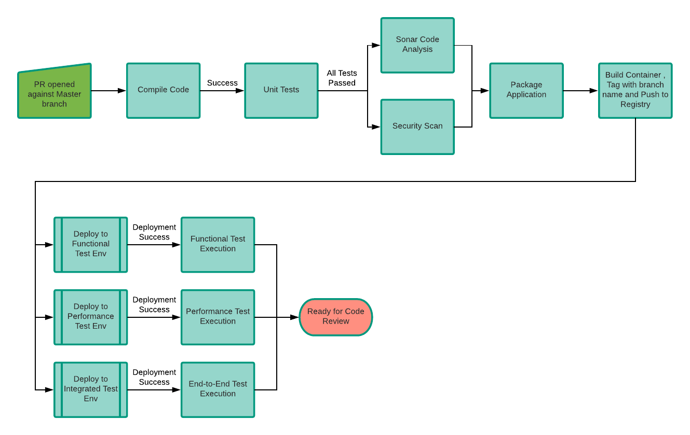
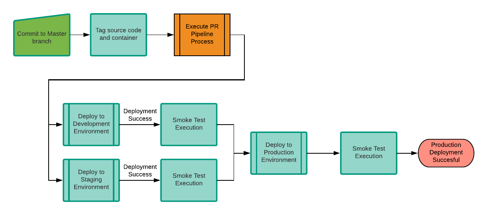

# Continuous Delivery Pipeline
This pipeline models the "Develop off of master branch" philosophy. All development work is done on short-lived feature branches and a Pull Request (PR) is openned when the feature is considered to be complete. The PR is built, testing using automated test cases and then reviewed for completeness. When the PR is approved, it is merged to master. Commits to master are considered to be production ready. The code is built, tested, released and promoted through Development, Staging and Production environments.

## Using the Pipeline Library
Create a Jenkins file at the root of your repository like the example below. Add any configuration properties that are needed.
```groovy
mavenPipeline {
    applicationName = 'sample-app'
}
```

### Configuration Properties
* applicationName - Name of the container image to create. Required.
* dockerContext - Directory for Docker build context. Optional. Defaults to the root directory of your repository.

## Triggers
The pipeline is triggered under the following scenarios:
* PR opened against the `master` branch
* Commit to the `master` branch

## Pull Requests
When a PR is opened against the `master` branch, this portion of the pipeline is triggered.


1. **Checkout and Compile Source Code**</br>
Checkout source code from the PR branch in Github and compile the source code.
1. **Unit Test Execution**</br>
Execute Unit tests and attached test results to the build.
1. In Parallel:
    * **Sonar Code Analysis**</br>
    Sonar code findings added to PR as comments. Fail build if Sonar Quality Gate is not passed. 
    * **Security Scanning**</br>
    Static code analysis looking for known code vulnerabilities and patterns.
1. **Package Application**</br>
Done by running `mvn package`
1. **Build Container**</br>
Build the application container using `docker build`, tagging it with the PR number. Push this image to the Docker registry.
1. In Parallel, deploy the application container to the following ephemiral testing environments and execute the associated test cases:
    * Function Test Environment
    * Performance Test Environment
    * End-to-End Integrated Test Environment
1. **Update PR with build success**</br>

## Commit to Master Branch
When a commit is made to the `master` branch, this portion of the pipeline is triggered.

1. **Checkout and Compile Source Code**</br>
Checkout source code from the PR branch in Github and compile the source code.
1. **Tag source code**</br>
Determine the next release number and tag the source code with that new release number.
1. **Execute stages from PR Pipeline**</br>
Perform all the stages from the [PR pipeline](#Pull-Requests) using the tagged source code and releasee number.
1. **Deploy to Development and Staging**</br>
In parallel, deploy the released application container to the development and staging environments. Execute smoke tests to verify the deployments.
1. **Deploy to Production**</br>
Deploy the released application container to the production environment. Execute smoke tests to verify the deployments.

## General Notes
* If any failures occur or quality gates are not passed, the build will be failed and [Notifications](notifications.md) sent out.
* All deployments are done using a rolling deployment; introducing the new container instance, verifying its health and then removing the older container instances.